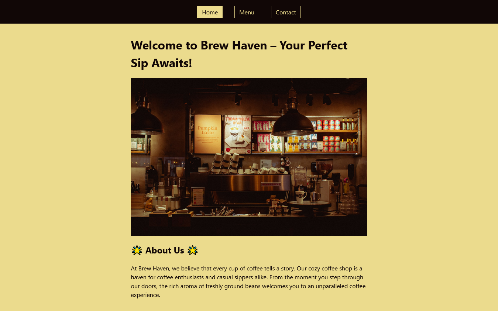

### Restaurant Page

This is a solution to The Odin Project's [Restaurant Page](https://www.theodinproject.com/lessons/node-path-javascript-restaurant-page). It aims to practice DOM manipulation and understand how Webpack works.

[View demo](#view-demo)
•
[Screenshot](#screenshot)
•
[Built with](#built-with)

#### View demo

[Click here to see the live demo of this project on GitHub Pages.](https://jsklcodes.github.io/restaurant-page/)

#### Screenshot

Página inicial

#### Built with

- CSS
- JavaScript
- DOM Manipulation
- Webpack
